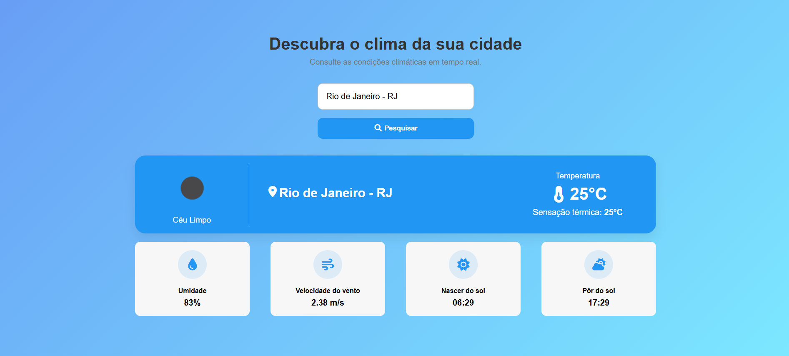

# 🌤️ Weather App

Uma aplicação web desenvolvida com **HTML, CSS e JavaScript** que permite consultar as condições climáticas de qualquer cidade brasileira em tempo real.

O projeto consome dados da **OpenWeather API** e da **API de Localidades do IBGE**, oferecendo uma interface moderna, responsiva e intuitiva para visualizar informações meteorológicas.

## ✨ Funcionalidades

- 🔎 Pesquisa de cidades com autocomplete.
- 📍 Identificação da cidade e estado.
- 🌡️ Temperatura atual.
- 🥵 Sensação térmica.
- 💧 Umidade do ar.
- 💨 Velocidade do vento.
- 🌅 Horário do nascer do sol.
- 🌇 Horário do pôr do sol.
- ☁️ Descrição das condições climáticas.
- 📱 Layout responsivo para desktop, tablet e dispositivos móveis.

## 🛠️ Tecnologias utilizadas

- HTML5
- CSS3
- JavaScript (ES Modules)
- OpenWeather API
- API de Localidades do IBGE
- Font Awesome

## 📷 Demonstração


## 📚 Aprendizados

Durante o desenvolvimento deste projeto foram praticados conceitos como:

- Consumo de APIs REST.
- Programação assíncrona com `async/await`.
- Manipulação do DOM.
- Modularização com JavaScript ES Modules.
- Responsividade utilizando Flexbox e Media Queries.
- Integração entre múltiplas APIs.

---

# 🚀 Como executar o projeto

1. Clone o repositório:

```bash
git clone https://github.com/SEU-USUARIO/WeatherApp.git
```

2. Acesse a pasta do projeto.

3. Abra o projeto utilizando um servidor local (como a extensão **Live Server** do VS Code).

4. Configure sua API Key conforme a seção abaixo.

---

# Configuração da API

Este projeto utiliza a API da **OpenWeather** para obter informações climáticas em tempo real.

Antes de executar o projeto, é necessário gerar uma chave de API gratuita.

### 1. Crie uma conta

Acesse o site:

https://home.openweathermap.org/users/sign_up

Crie uma conta gratuita e confirme seu e-mail.

---

### 2. Gere sua API Key

Após fazer login, acesse:

https://home.openweathermap.org/api_keys

Crie uma nova chave (API Key) ou utilize a chave padrão disponibilizada pela plataforma.

> **Observação:** A ativação da chave pode levar alguns minutos.

---

### 3. Configure a chave no projeto

No arquivo `js/api.js`, substitua a constante abaixo pela sua chave:

```javascript
const API_KEY = "SUA_API_KEY";
```

Exemplo:

```javascript
const API_KEY = "1234567890abcdef1234567890abcdef";
```

---

### 4. Execute o projeto

Após configurar a chave, basta abrir o projeto em um servidor local (como a extensão **Live Server** do VS Code) e realizar uma pesquisa por uma cidade.

> **Importante:** Este projeto foi desenvolvido apenas para fins de estudo. Como é uma aplicação Front-End, a API Key fica visível no navegador. Em aplicações reais, recomenda-se utilizar um backend para proteger credenciais sensíveis.